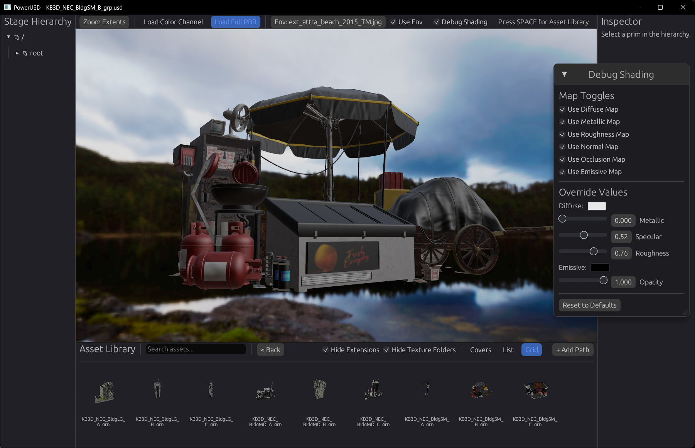

# PowerUSD

Fast USD asset browser and viewer built in pure Rust.

## Why?

Current 3D asset library software are:
- Too slow.
- Bloated.
- Subscription services.
- No 3D viewer.
- No USD support.

I made this so I can stop dealing with .blend or .max files people are selling and build a 3D asset library that runs on a proper format with a lightweight viewing capability. FBX is just as horrible.

## Interface



### Asset Library Browser (SPACE to toggle)
- Grid and list view modes
- Thumbnail support (JPG/PNG next to USD files)
- Fast directory scanning with search
- Persistent library paths (saved to config)

### 3D Viewer
- USD/USDC/USDA support
- GLB support (with animations)
- Drag & drop file loading
- Orbit camera controls
- Z-up to Y-up conversion (3ds Max support)
- UsdPreviewSurface
- Multi-material mesh support (GeomSubsets)
- Multithreaded texture loading/resizing

### PBR & Debug Shading
- **Load Color Channel** - Diffuse textures only (fast preview)
- **Load Full PBR** - Full UsdPreviewSurface (diffuse, normal, occlusion, emissive)
- Click again to unload textures and free memory
- **Debug Shading** - Toggle individual maps, adjust material values
- **Environment Maps** - Load HDR/EXR for IBL lighting

### Scene Inspector
- Hierarchy browser
- Property inspector

## Thumbnails

Place thumbnail images next to your USD files:
- `MyModel.usd` → `MyModel.jpg` or `MyModel.png`
- `KitbashPack/` → `KitbashPack.jpg` or `KitbashPack/cover.jpg`

## Building

```bash
git clone --recursive https://github.com/cl0nazepamm/powerusd.git
cd powerusd
cargo build --release
```

## Controls

- **SPACE** - Toggle asset library
- **Left Mouse** - Orbit camera
- **Middle Mouse** - Pan camera
- **Scroll** - Zoom
- **Drag & Drop** - Load USD file

## Dependencies

- [openusd](https://github.com/mxpv/openusd) - Pure Rust USD parser (git submodule under `deps/`)
- [three-d](https://github.com/asny/three-d) - 3D rendering engine (vendored, modified fork under `deps/three-d`)
- [egui](https://github.com/emilk/egui) - Immediate mode GUI

## License

MIT
