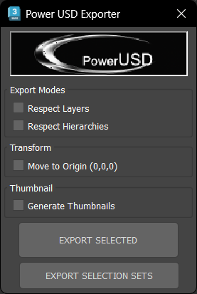
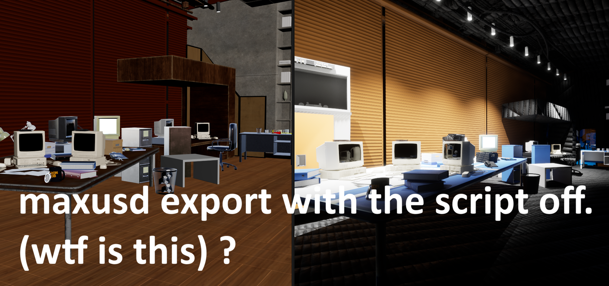
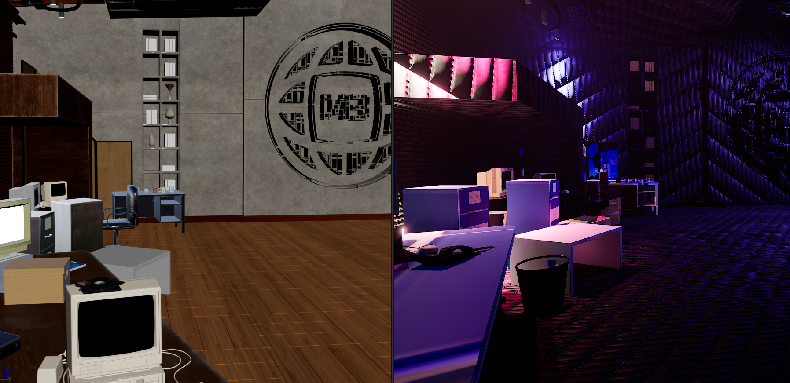
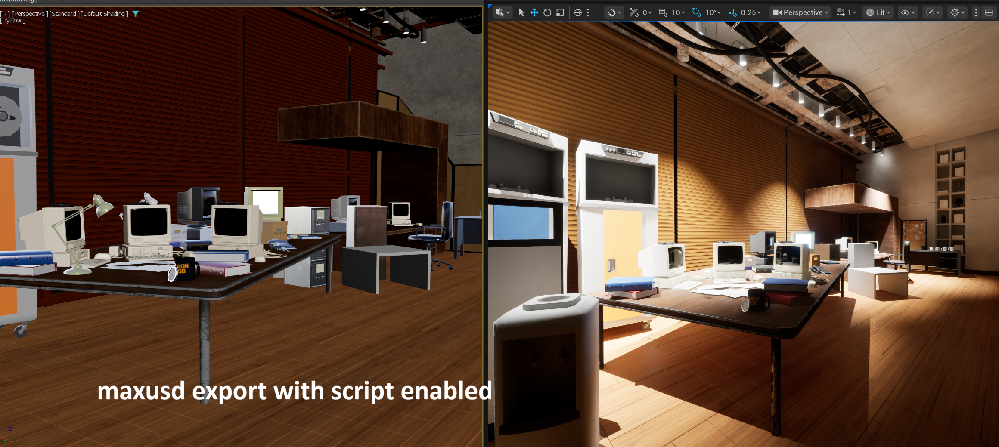
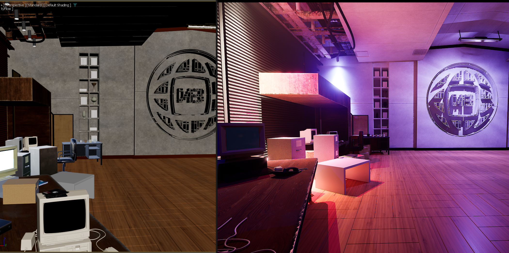
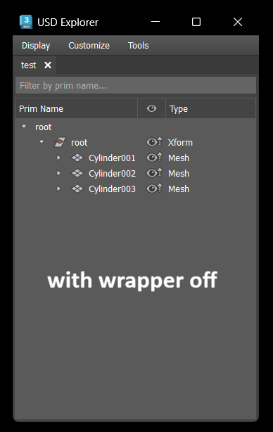
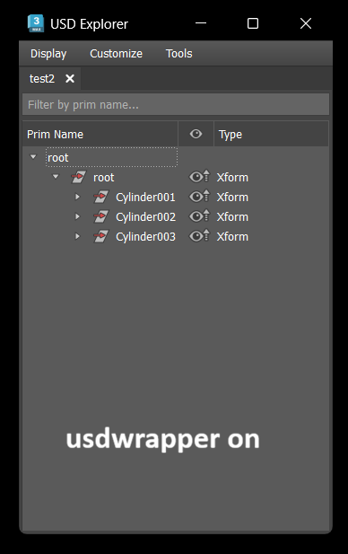
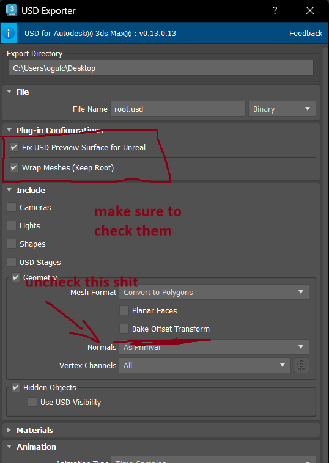

# DCC Exporters

Batch USD exporters for 3ds Max and Blender. Comes with a python script to fix maxusd material. (removes nodegraphs)

## Features

- Batch export multiple objects/layers/hierarchies/selection sets option.
- Automatic UsdPreviewSurface material cleanup so it doesnt come as a mess like Autodesk wants it.
- Move-to-origin option for clean exports
- Thumbnail generation for assets.

### Scripts

| Script | Description |
|--------|-------------|
| `PowerUSD.ms` | Main batch USD exporter with UI. Supports layer-based, hierarchy-based, and selection set exports. |


### maxusd Python scripts

| Script | Description |
|--------|-------------|
| `Clone_USD_CleanStruct.py` | Fixes UsdPreviewSurface connections for Unreal Engine by bypassing NodeGraphs. |
| `Clone_USD_usdWrapper.py` | Wraps mesh under one more xform. See pictures below to understand what it actually does. |


### Screenshots

# Here is what USD scene looks like without script. Unreal fails to display usdpreviewsurface correctly. Blender import is just blank. (nothing)




# Exported with python script enabled. Scene uses a mix of physicalmaterial and usdpreviewsurface.




# This is an optional script to wrap every mesh under one more xform (keeps pivots. this was useful for editing stage in unreal)



### Export Modes

- **Standard**: Export each selected object as a separate USD file
- **Respect Layers**: Export one USD file per layer containing selected objects
- **Respect Hierarchies**: Export one USD file per hierarchy root (root + all children)
- **Selection Sets**: Export all named Selection Sets as separate USD files

### Settings to Change



## 3ds Max

### Installation

1. Copy `PowerUSD.ms` to your 3ds Max scripts folder:
   ```
   Drag and drop it to your 3dsmax viewport to install.
   ```

2. Copy the `chasers` folder contents to the same location:
   ```
   %USERPROFILE%\AppData\Local\Autodesk\3dsMax\<version>\ENU\scripts\CloneTools\
   ```

3. Copy `powerusd_logo.png` from `icons` to:
   ```
   %USERPROFILE%\AppData\Local\Autodesk\3dsMax\<version>\ENU\usericons\PowerUSD\
   ```


## Blender

### Installation

1. In Blender, go to Edit > Preferences > Add-ons
2. Click "Install" and select the `Clone_PowerUSD` folder
3. Enable the addon

### Usage

The addon adds a panel in the 3D View sidebar for one-click USD batch export.

## Requirements

### 3ds Max
- Autodesk 3ds Max 2024 or newer
- USD for 3ds Max plugin

### Blender
- Blender 4.0 or newer (with built-in USD support)

## Credits

Script was originally written by Autodesk developer Julien Deboise. I've only improved it for my usage.

- [deboisj](https://github.com/deboisj/)

## License

MIT License


